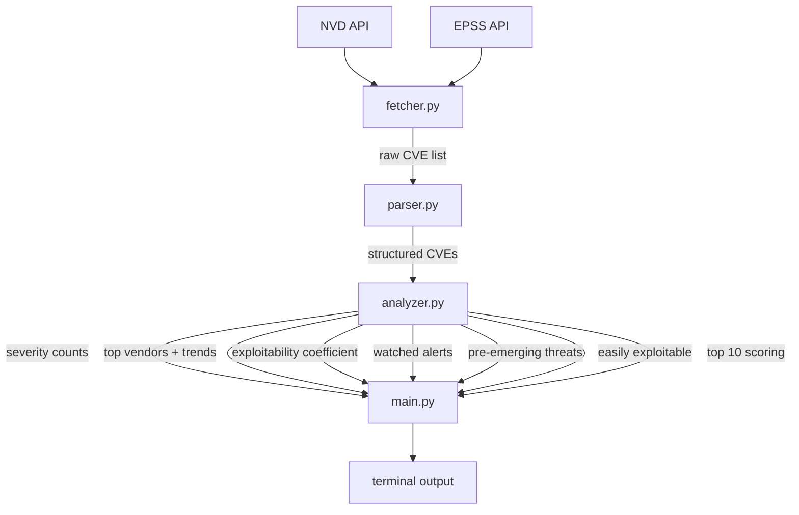

# ThreatWatch
> CVE threat intelligence — because CVSS 10.0 doesn't mean anyone is trying.

---

## Table of Contents

1. [Motivation](#motivation)
2. [Architecture](#architecture)
3. [Data Pipeline](#data-pipeline)
4. [Design Decisions](#design-decisions)
   - [Vendor Extraction](#vendor-extraction)
   - [CVSS vs EPSS](#cvss-vs-epss)
   - [Vendor Exploitability Coefficient](#vendor-exploitability-coefficient)
   - [Pre-Emerging Threats](#pre-emerging-threats)
5. [Installation](#installation)
6. [Usage](#usage)
7. [Sample Output](#sample-output)
8. [Limitations & Future Work](#limitations--future-work)
9. [Stack](#stack)

---

## Motivation

Standard vulnerability tooling sorts by CVSS. CVSS is a severity ceiling — it answers "how bad could this get if perfectly exploited." It does not answer "is anyone trying."

This month's data makes the problem concrete. The 10 highest-scoring CVEs all carry CVSS 10.0. Their average EPSS is **0.08%**. litellm — an AI/LLM orchestration library sitting between applications and language model APIs — carries CVSS 9.8 and EPSS **54.3%**.

Sorting by CVSS buries litellm under a list of theoretically catastrophic but practically ignored vulnerabilities. ThreatWatch is built to surface the second category.

---

## Architecture



Each module has one responsibility. `fetcher.py` handles all network I/O. `parser.py` extracts structured data from raw NVD JSON. `analyzer.py` generates all signals — no output logic, no API calls. `main.py` orchestrates and renders.

---

## Data Pipeline

**Fetching**

NVD CVE API v2.0 is queried twice per run — once for the current period, once for the previous equivalent window (used for trend computation). Severity filter is applied at the API level (`cvssV3Severity=HIGH` and `cvssV3Severity=CRITICAL` in separate requests, since NVD doesn't accept range queries).

NVD returns max 2000 results per page. Pagination is handled automatically via `startIndex` until `startIndex >= totalResults`. Without an API key, the rate limit is 5 requests per 30 seconds — requests are spaced with a fixed 6-second sleep between pages, with exponential backoff on 403/429 responses reading `Retry-After` headers where present.

EPSS scores are fetched in batches of 100 CVE IDs per request from the FIRST.org API, after all NVD data is collected.

**Parsing**

For each CVE, the parser extracts:

| Field | Source |
|---|---|
| CVE ID | `cve.id` |
| Published date | `cve.published[:10]` |
| CVSS score | `cvssMetricV31[type=Primary].baseScore` |
| Severity | `cvssMetricV31[type=Primary].baseSeverity` |
| Vector string | `cvssMetricV31[type=Primary].vectorString` |
| Description | `descriptions[lang=en].value` |
| Vendor | See vendor extraction |
| CWE group | `weaknesses[].description[].value` → mapped category |
| EPSS | Cross-referenced from FIRST.org batch response |
| Easily exploitable | `AV:N` and `AC:L` and `PR:N` in vector string |
| Disputed severity | Primary vs Secondary score delta > 2.0 |

---

## Design Decisions

### Vendor Extraction

The brief asks for "primary affected vendor" without specifying how to derive it. NVD has no vendor field — vendor data lives in CPE strings inside `configurations.nodes.cpeMatch`.

CPE format: `cpe:2.3:type:vendor:product:version:...`

Extraction hierarchy:

1. **CPE** — parse `criteria` string, take index `[3]`. When CPE is present and the CVE status is `Analyzed`, this is reliable.
2. **Description pattern matching** — regex on `"vulnerability in [X]"` and `"[X] is vulnerable"`. Noisy but recovers some CVEs without CPE.
3. **`unknown`** — fallback when neither source yields a result.

The structural problem: CVEs in `Awaiting Analysis` status have no CPE data. These are often the most recent and highest-EPSS entries — NVD analysts can take days to process them. The tool marks them `unknown` and excludes them from vendor rankings, which means the rankings slightly undercount brand-new threats. A more complete fallback would use the `sourceIdentifier` field — the CNA that published the CVE — but that requires mapping CNA identifiers to vendor names, which is doable but outside the 2h scope.

A disputed severity flag is also computed: when the NVD primary CVSS score and the CNA secondary score differ by more than 2.0 points, something is worth a second look. Vendors have incentive to score their own vulnerabilities lower.

Watched vendors (google, microsoft, github, okta, slack, salesforce) are defined in `config.py`. In production this would be user-configurable — loaded from a file or environment variable based on the organization's actual SaaS stack.

### CVSS vs EPSS

CVSS is static and context-free. It doesn't change based on whether exploit code exists, whether the vulnerable software is widely deployed, or whether attackers are actively targeting it.

EPSS (Exploit Prediction Scoring System) is a daily-updated probabilistic model trained on real exploitation telemetry. It answers a different question: given everything observable right now, what's the probability this CVE gets exploited in the next 30 days.

Neither signal alone is sufficient. A CVSS 10.0 / EPSS 0.0% CVE may never be exploited. A CVSS 7.5 / EPSS 40% CVE is actively being weaponized. ThreatWatch uses both.

### Vendor Exploitability Coefficient

Simple metric: `CVE count × average EPSS` per vendor.

This month: Microsoft has 109 CVEs, average EPSS 0.1%, coefficient 15.0. litellm has 5 CVEs, average EPSS 10.9%, coefficient 54.5.

The coefficient surfaces vendors where exploitation probability is concentrated, not just where CVE volume is high. It doesn't handle the edge case of a single high-EPSS critical CVE from a low-volume vendor well — that case is handled separately in pre-emerging threats.

### Pre-Emerging Threats

CVEs with EPSS > 15% from vendors outside the mainstream (Microsoft, Google, Adobe, Cisco, Apple, Linux, Oracle excluded). These don't appear in top-5 by volume but carry disproportionate real-world risk.

Each CVE description is scanned for SaaS/cloud attack surface signals using keyword matching against defined categories: OAuth/token abuse, API exposure, AI/LLM infrastructure, supply chain, cloud storage, identity/SSO. When a match is found, the category surfaces in output. When no match is found, a truncated description is shown instead — the absence of a tag is also information.

Threshold rationale: below 15% EPSS, the signal-to-noise ratio degrades. Above it, something is moving.

---

## Installation

```bash
pip install httpx rich
```

No API key required. Without one, the script respects NVD's rate limit of 5 requests per 30 seconds automatically. A free key can be requested at [nvd.nist.gov](https://nvd.nist.gov/developers/request-an-api-key) and bumps the limit to 50 requests per 30 seconds.

---

## Usage

```bash
python main.py                   # last 30 days, all vendors
python main.py --days 60         # custom period
python main.py --vendor okta     # filter by vendor
```

---

## Sample Output

```
THREATWATCH — CVE Threat Monitor
Period : 2026-04-28 → 2026-05-28
Total  : 1402 CVEs (CVSS ≥ 7.0)

── SEVERITY BREAKDOWN ──────────────────────
  CRITICAL     275
  HIGH        1127

── TOP 5 VENDORS ───────────────────────────
  1.  microsoft           109 CVEs   ↑ +113%
  2.  wordpress           104 CVEs   ↑ +65%
  3.  openclaw             58 CVEs   → stable
  4.  linux                54 CVEs   ↑ +31%
  5.  adobe                30 CVEs   → stable

── VENDOR EXPLOITABILITY COEFFICIENT ───────
  real-world risk = CVE volume × avg EPSS

  litellm              5 CVEs  avg EPSS  10.9%  coeff   54.5  HIGH ACTIVE RISK
  wordpress          104 CVEs  avg EPSS   0.5%  coeff   46.9  HIGH ACTIVE RISK
  linux               54 CVEs  avg EPSS   0.5%  coeff   27.7  MODERATE RISK
  nx                   1 CVEs  avg EPSS  26.8%  coeff   26.8  MODERATE RISK
  microsoft          109 CVEs  avg EPSS   0.1%  coeff   15.0  low exploitation

── WATCHED VENDOR ALERTS ───────────────────
  google            2 CVEs  max CVSS 9.6  max EPSS 0.1%
  microsoft       109 CVEs  max CVSS 10.0  max EPSS 4.1%
  github            2 CVEs  max CVSS 9.8  max EPSS 0.1%

── PRE-EMERGING THREATS ────────────────────
  high EPSS, non-mainstream vendors — weaponization likely soon

  CVE-2026-42208   litellm   CVSS 9.8  EPSS 54.3%  [API attack surface]
  CVE-2026-48027   nx        CVSS 9.8  EPSS 26.8%  [Supply chain risk]

── EASILY EXPLOITABLE (AV:N/AC:L/PR:N) ────
  CVE-2026-42208   litellm        CVSS 9.8  EPSS 54.3%  HIGH PROB
  CVE-2026-8679    wordpress      CVSS 7.5  EPSS 27.7%
  CVE-2026-48027   nx             CVSS 9.8  EPSS 26.8%

── TOP 10 HIGHEST SCORING ──────────────────
  CVE ID                 Vendor         CVSS   EPSS    Severity   Attack
  ─────────────────────────────────────────────────────────────────────────
  CVE-2026-35051         traefik        10.0   0.0%    CRITICAL   other
  CVE-2026-39858         traefik        10.0   0.1%    CRITICAL   auth_bypass
  CVE-2026-26332         vm2_project    10.0   0.1%    CRITICAL   injection
  CVE-2026-33587         lfnovo         10.0   0.1%    CRITICAL   other
  CVE-2026-35435         microsoft      10.0   0.1%    CRITICAL   auth_bypass
  CVE-2026-44643         peerigon       10.0   0.1%    CRITICAL   rce
  CVE-2026-41553         dhtmlx         10.0   0.3%    CRITICAL   injection
  CVE-2026-42960         nlnetlabs      10.0   0.0%    CRITICAL   other
  CVE-2026-42901         microsoft      10.0   0.0%    CRITICAL   auth_bypass
  CVE-2026-30893         wazuh          9.9    0.1%    CRITICAL   access_control
```

---

## Limitations & Future Work

**Vendor extraction accuracy** — CPE parsing takes the first `cpeMatch` entry. In supply chain CVEs where a vulnerability propagates through a library to downstream consumers, the first match is often the library, not the affected product. Filtering for `vulnerable: true` entries and deduplicating by vendor would improve accuracy.

**Trend window sensitivity** — month-over-month comparison is sensitive to patch release cycles. Vendors that batch their security updates show artificial spikes. A 90-day rolling baseline would produce more stable trend signals.

**CISA KEV integration** — EPSS measures probability; KEV confirms reality. Cross-referencing would add a third exploitation signal and allow a stronger action trigger: EPSS > 20% AND KEV presence.

**EPSS latency** — EPSS updates daily but lags real-world exploitation by design. A CVE can be actively exploited for 48 hours before the model updates. The 15% pre-emerging threshold partially compensates but is not a substitute for real-time threat feeds.

**No persistence** — each run is stateless. Storing results in SQLite would enable genuine historical trending, anomaly detection across weeks, and diff-based alerting on new CVEs per vendor.

---

## Stack

- [NVD CVE API v2.0](https://nvd.nist.gov/developers/vulnerabilities)
- [EPSS API — FIRST.org](https://www.first.org/epss/api)
- [httpx](https://www.python-httpx.org/) — HTTP client
- [rich](https://github.com/Textualize/rich) — terminal output and tables
