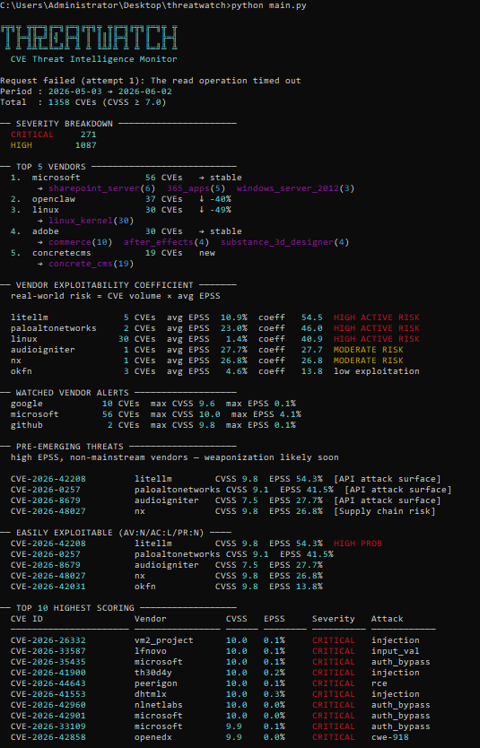

# ThreatWatch
CVE threat intelligence-high CVSS doesn't mean anyone is trying.

---

## Table of Contents

1. [Motivation](#motivation)
2. [Architecture](#architecture)
3. [Data Pipeline](#data-pipeline)
4. [Design Decisions](#design-decisions)
5. [Installation](#installation)
6. [Usage](#usage)
7. [Sample Output](#sample-output)
8. [Limitations and Future Work](#limitations-and-future-work)
9. [Stack](#stack)

---

## Motivation

Fetching CVEs and extracting fields is the easy part. Figuring out what a useful summary actually looks like is where it gets interesting.

The obvious approach is to sort by CVSS. But CVSS measures theoretical impact-how bad things could get under perfect conditions. It doesn't tell you whether anyone is trying.

This month's data makes the problem concrete. The 10 highest-scoring CVEs all have CVSS 10.0. Their average EPSS is 0.08%. litellm, an AI/LLM orchestration library that sits between applications and language model APIs, has CVSS 9.8 and EPSS 54.3%. It doesn't appear in the top 10 by score. It's the most actionable finding in the dataset.

That's what ThreatWatch is built around. CVSS and EPSS answer different questions and you need both.

---

## Architecture


Each module has one job. `fetcher.py` handles all network I/O. `parserr.py` extracts structured data from raw NVD JSON. `analyzer.py` generates all signals - no output logic, no API calls. `main.py` orchestrates and renders.

---

## Data Pipeline

**Fetching**

NVD CVE API v2.0 is queried twice per run-current period and previous equivalent window for trend comparison. HIGH and CRITICAL are fetched in separate requests because NVD doesn't accept score range queries, only exact severity labels.

Pagination is handled automatically via `startIndex`. Without an API key the rate limit is 5 requests per 30 seconds, so requests are spaced with 6-second sleeps and exponential backoff on 403/429 responses with `Retry-After` header support.

EPSS scores are fetched in batches of 100 CVE IDs per request after all NVD data is collected.

**Parsing**

For each CVE:

| Field | Source |
|---|---|
| CVE ID | `cve.id` |
| Published date | `cve.published[:10]` |
| CVSS score | `cvssMetricV31[type=Primary].baseScore` |
| Severity | `cvssMetricV31[type=Primary].baseSeverity` |
| Vector string | `cvssMetricV31[type=Primary].vectorString` |
| Description | `descriptions[lang=en].value` |
| Vendor | See design decisions |
| CWE group | `weaknesses[].description[].value` mapped to category |
| EPSS | Cross-referenced from FIRST.org batch response |
| Easily exploitable | AV:N + AC:L + PR:N in vector string |
| Disputed severity | Primary vs Secondary score delta > 2.0 |

---

## Design Decisions

**Primary affected vendor**

The brief left this open. NVD has no vendor field-vendor lives inside CPE strings in `configurations.nodes.cpeMatch`, format `cpe:2.3:type:vendor:product:version`.

Extraction hierarchy:
1. CPE data - reliable when status is `Analyzed`
2. Description pattern matching -regex on common vulnerability description patterns, recovers some CVEs without CPE
3. `unknown`-when nothing works.

CVEs in `Awaiting Analysis` or `Deferred` status have no CPE. These are often the most recent entries and sometimes the highest-EPSS ones. They get marked unknown and excluded from vendor rankings only but they still appear in top 10 scoring and pre-emerging threats where vendor attribution isn't required.

Vendors have incentive to score their own vulnerabilities lower. When CNA secondary score differs from NVD primary by more than 2.0 points, the CVE is flagged as disputed.

Watched vendors are defined in `config.py`. In production this would be loaded from a file or environment variable based on what SaaS tools the organization actually uses.

**CVSS vs EPSS**

CVSS is static. It doesn't update when exploit code drops or when attackers start actively targeting something. EPSS is recalculated daily based on real exploitation telemetry - it answers what's actually being targeted right now.

Neither alone is enough. CVSS 10.0 / EPSS 0.0% means maximum theoretical damage, near-zero real-world activity. CVSS 7.5 / EPSS 40% means actively weaponized. ThreatWatch uses both and makes the difference visible.

**Vendor Exploitability Coefficient**

`CVE count x average EPSS` per vendor.

Microsoft has 56 CVEs this month, average EPSS 0.1%, coefficient 5.6. litellm has 5 CVEs, average EPSS 10.9%, coefficient 54.5. The coefficient surfaces where exploitation probability is actually concentrated, not just where CVE volume is high.

**Pre-emerging threats**

CVEs with EPSS above 15% from non-mainstream vendors. These don't appear in top-5 by volume but are the ones most likely moving toward active exploitation.

Each description is scanned for SaaS/cloud attack surface signals - OAuth and token references, API patterns, AI/LLM infrastructure keywords, supply chain indicators, identity and SSO components. When a match is found it surfaces as a tag. When it doesn't, a truncated description is shown instead, because no tag is also information.

15% threshold: below that the signal-to-noise ratio gets bad. Above it, something is moving.

---

## Installation

```bash
pip install httpx rich
```

No API key required. Without one the script respects NVD's 5 req/30s rate limit automatically. Free key available at [nvd.nist.gov](https://nvd.nist.gov/developers/request-an-api-key) for 50 req/30s.

---

## Usage

```bash
python main.py                   # last 30 days
python main.py --days 60         # custom period
python main.py --vendor okta     # filter by vendor
```

---

## Sample Output



---

## Limitations and Future Work

**Vendor extraction** takes the first CPE match. In supply chain CVEs where a vulnerability propagates through a library to downstream consumers the first match is often the library, not the affected product. Filtering for `vulnerable: true` and deduplicating would be more accurate.

**NVD enrichment backlog** - NIST has acknowledged NVD can no longer enrich every CVE at the same speed. CVEs before March 2026 are being moved to "Not Scheduled" status, creating a blind spot for tools relying on NVD metadata. A production version would cross-reference VulnCheck or OSV as fallback.

**Time-to-exploit compression** - Mandiant M-Trends 2026 puts mean time to exploit at negative seven days, meaning exploitation often happens before a patch exists. This tool operates on published CVEs only. Integration with PoC tracking (Exploit-DB, GitHub security advisories) would close that gap.

**CISA KEV integration** - EPSS measures probability, KEV confirms reality. EPSS above 20% combined with KEV presence would be a near-certain action trigger.

**No persistence** - each run is stateless. SQLite storage would enable real historical trending and diff-based alerting: litellm had 0 CVEs last week, 5 this week, EPSS 54% - that delta is more actionable than the absolute count.

**AI/LLM vendor coverage** - CVE volume for AI tooling (LangChain, litellm, OpenClaw, Langflow) is rising fast in 2026 as AI-assisted vulnerability discovery scales. The current SaaS signal tagging partially covers this but a dedicated category with tighter keyword matching would improve signal quality.

**Trend window** - two consecutive 30-day windows is sensitive to patch release cycles. A 90-day rolling baseline would reduce noise from vendors that batch their security updates.

---

## Stack

- [NVD CVE API v2.0](https://nvd.nist.gov/developers/vulnerabilities)
- [EPSS API - FIRST.org](https://www.first.org/epss/api)
- [httpx](https://www.python-httpx.org/)
- [rich](https://github.com/Textualize/rich)
