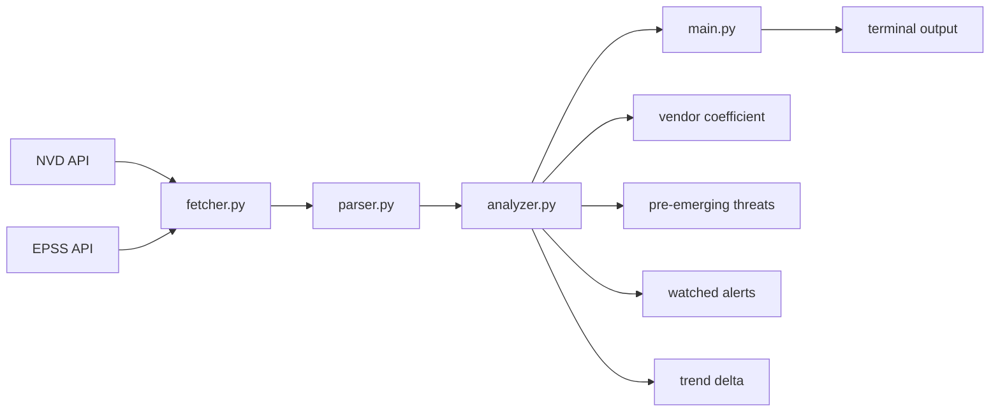

# ThreatWatch

A CVE intelligence tool built around one observation: **CVSS 10.0 doesn't mean anyone is trying.**

---

## The problem with sorting by severity

The 10 highest-scoring CVEs this month all carry CVSS 10.0. Their average EPSS is 0.08%.

litellm has CVSS 9.8 and EPSS 54.3%.

That inversion is the whole point. CVSS measures a theoretical ceiling — the worst-case impact if conditions are perfect and an attacker knows exactly what they're doing. EPSS measures what's actually happening: the probability that a CVE gets exploited in the wild within the next 30 days, based on real telemetry.

A vulnerability can be catastrophic in theory and ignored in practice. It can also be moderately severe on paper and actively weaponized right now. Sorting by CVSS alone buries the second category under the first.

ThreatWatch combines both signals.

---

## Architecture



**fetcher.py** — handles NVD pagination, rate limiting, and EPSS batch fetching. NVD returns max 2000 results per request and enforces 5 req/30s without an API key — requests are spaced accordingly with exponential backoff and `Retry-After` header support. EPSS is fetched in batches of 100 CVE IDs per request.

**parser.py** — extracts structured data from raw NVD JSON. The interesting part is vendor extraction.

**analyzer.py** — all signal generation lives here. No output logic, no API calls.

**main.py** — orchestration and terminal rendering via `rich` for colored output and tables. No external logging frameworks.

---

## On vendor extraction

The brief says "primary affected vendor" and leaves the rest open. NVD doesn't have a vendor field — it has CPE (Common Platform Enumeration) strings buried inside `configurations.nodes.cpeMatch`. Format: `cpe:2.3:type:vendor:product:version:...`

The extraction hierarchy:

1. **CPE data** — most reliable. Parse the criteria string, take index 3 (vendor). When CPE is present, this is unambiguous.
2. **Description text** — pattern match on `"vulnerability in [X]"` and `"[X] is vulnerable"`. Noisy but useful when CPE is missing.
3. **`unknown`** — when neither works.

The noise problem: CVEs in `Awaiting Analysis` status haven't been processed by NVD analysts yet — no CPE, sometimes vague descriptions. These are often the most recent and highest-EPSS entries. The tool marks them `unknown` and excludes them from vendor rankings, which means the rankings slightly underrepresent brand-new threats. A more complete fallback would use the `sourceIdentifier` field — the CNA that published the CVE — but that requires mapping CNA identifiers to vendor names, which is doable but outside the 2h scope.

A disputed severity flag is also computed: when the NVD primary CVSS score and the CNA secondary score differ by more than 2.0 points, something is worth a second look. Vendors have incentive to score their own vulnerabilities lower.

---

## Vendor Exploitability Coefficient

Top 5 vendors by CVE count this month: Microsoft (109), WordPress (104), OpenClaw (58), Linux (54), Adobe (30).

By that ranking, Microsoft looks like the biggest problem.

The coefficient is `CVE count × average EPSS`. Microsoft: 109 × 0.1% = 15.0. litellm: 5 × 10.9% = 54.5.

litellm is an AI/LLM orchestration library — it sits between applications and language model APIs, handling authentication, routing, and token management. A critical vulnerability in that layer has a very different blast radius than a Windows driver bug that requires local access to exploit.

The coefficient doesn't capture everything. A single CVSS 10.0 / EPSS 80% CVE from a vendor with no other entries would rank low by volume but should dominate attention. The pre-emerging section handles that case.

---

## Pre-emerging threats

High EPSS from non-mainstream vendors. These don't make the top-5 list because CVE count is low — but exploitation probability is high.

CVE description is scanned for SaaS/cloud attack surface signals: OAuth and token references, API and webhook patterns, AI/LLM infrastructure keywords, supply chain indicators, cloud storage misconfigurations, identity and SSO components. When a match is found, the tag surfaces in output. When it doesn't, a truncated description is shown instead — because no tag is also information.

The EPSS threshold is 15%. Below that, the signal-to-noise ratio drops. Above it, something is moving.

---

## What I'd improve

**Vendor extraction** is the weakest part. CPE parsing takes the first match — in multi-vendor CVEs (supply chain, shared libraries), that's often wrong. A better approach would filter for `vulnerable: true` entries and handle cases where the same CVE affects a library and everything downstream of it differently.

**Trend analysis** uses two consecutive 30-day windows. This is sensitive to random clustering — a vendor that ships patches in batches can look like it's spiking. A 90-day rolling baseline would be more stable.

**CISA KEV** would add a third exploitation signal: confirmed active exploitation, not just probability. The combination of EPSS > 20% and KEV presence would be a near-certain action trigger.

**EPSS latency** — EPSS scores update daily but lag real-world exploitation by design. A CVE can be actively exploited for 48 hours before EPSS catches up. The pre-emerging section partially compensates by using a low threshold, but it's not a substitute for real-time threat feeds.

---

## Usage

```bash
python main.py                   # last 30 days
python main.py --days 60         # custom period
python main.py --vendor okta     # filter by vendor
```

## Output

```
╔╦╗╦ ╦╦═╗╔═╗╔═╗╔╦╗╦ ╦╔═╗╔╦╗╔═╗╦ ╦
 ║ ╠═╣╠╦╝║╣ ╠═╣ ║ ║║║╠═╣ ║ ║  ╠═╣
 ╩ ╩ ╩╩╚═╚═╝╩ ╩ ╩ ╚╩╝╩ ╩ ╩ ╚═╝╩ ╩
  CVE Threat Intelligence Monitor

Period : 2026-04-28 → 2026-05-28
Total  : 1402 CVEs (CVSS ≥ 7.0)

── SEVERITY BREAKDOWN ──────────────────────
  CRITICAL     275
  HIGH        1127

── TOP 5 VENDORS ───────────────────────────
  1.  microsoft           109 CVEs   ↑ +113%
  2.  wordpress           104 CVEs   ↑ +65%
  3.  openclaw             58 CVEs   → stable
  4.  linux                54 CVEs   ↑ +31%
  5.  adobe                30 CVEs   → stable

── VENDOR EXPLOITABILITY COEFFICIENT ───────
  real-world risk = CVE volume × avg EPSS

  litellm              5 CVEs  avg EPSS  10.9%  coeff   54.5  HIGH ACTIVE RISK
  wordpress          104 CVEs  avg EPSS   0.5%  coeff   46.9  HIGH ACTIVE RISK
  linux               54 CVEs  avg EPSS   0.5%  coeff   27.7  MODERATE RISK
  nx                   1 CVEs  avg EPSS  26.8%  coeff   26.8  MODERATE RISK
  microsoft          109 CVEs  avg EPSS   0.1%  coeff   15.0  low exploitation

── WATCHED VENDOR ALERTS ───────────────────
  google            2 CVEs  max CVSS 9.6  max EPSS 0.1%
  microsoft       109 CVEs  max CVSS 10.0  max EPSS 4.1%
  github            2 CVEs  max CVSS 9.8  max EPSS 0.1%

── PRE-EMERGING THREATS ────────────────────
  high EPSS, non-mainstream vendors — weaponization likely soon

  CVE-2026-42208         litellm        CVSS 9.8  EPSS 54.3%  [API attack surface]
  CVE-2026-48027         nx             CVSS 9.8  EPSS 26.8%  [Supply chain risk]

── EASILY EXPLOITABLE (AV:N/AC:L/PR:N) ────
  CVE-2026-42208         litellm        CVSS 9.8  EPSS 54.3%  HIGH PROB
  CVE-2026-8679          wordpress      CVSS 7.5  EPSS 27.7%
  CVE-2026-48027         nx             CVSS 9.8  EPSS 26.8%

── TOP 10 HIGHEST SCORING ──────────────────
  CVE ID                 Vendor           CVSS   EPSS     Severity   Attack
  ────────────────────── ──────────────── ────── ──────── ────────── ────────────

  CVE-2026-35051         traefik          10.0   0.0%     CRITICAL   other
  CVE-2026-39858         traefik          10.0   0.1%     CRITICAL   auth_bypass
  CVE-2026-26332         vm2_project      10.0   0.1%     CRITICAL   injection
  CVE-2026-33587         lfnovo           10.0   0.1%     CRITICAL   other
  CVE-2026-35435         microsoft        10.0   0.1%     CRITICAL   auth_bypass
  CVE-2026-44643         peerigon         10.0   0.1%     CRITICAL   rce
  CVE-2026-41553         dhtmlx           10.0   0.3%     CRITICAL   injection
  CVE-2026-42960         nlnetlabs        10.0   0.0%     CRITICAL   other
  CVE-2026-42901         microsoft        10.0   0.0%     CRITICAL   auth_bypass
  CVE-2026-30893         wazuh            9.9    0.1%     CRITICAL   access_control
```

---

## Stack

Python · httpx · rich · [NVD CVE API v2.0](https://nvd.nist.gov/developers/vulnerabilities) · [EPSS API](https://www.first.org/epss/api)
